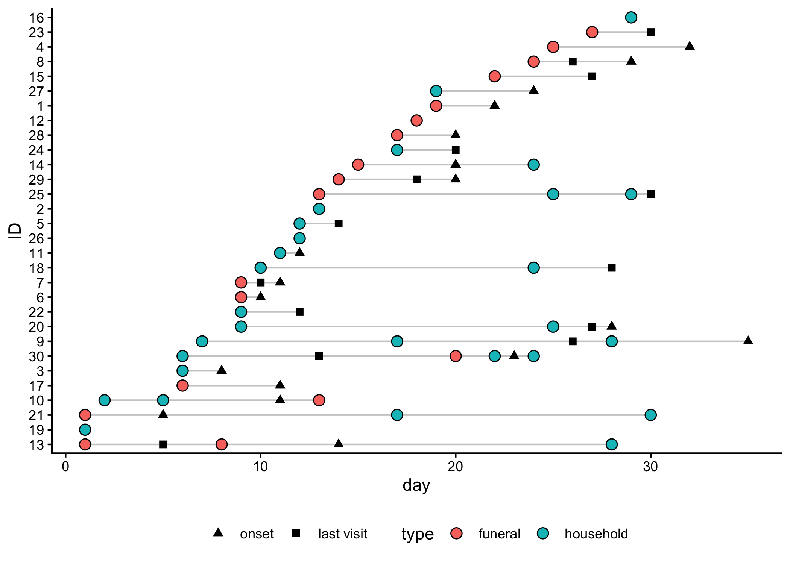
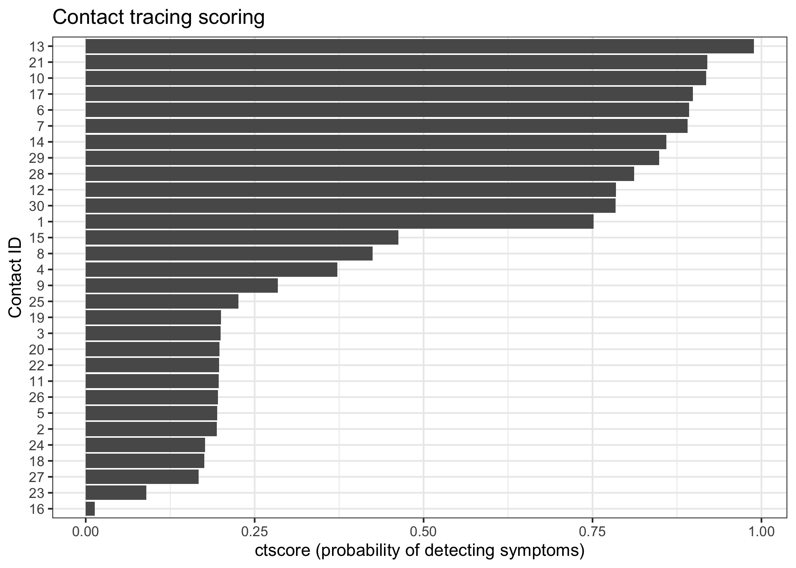
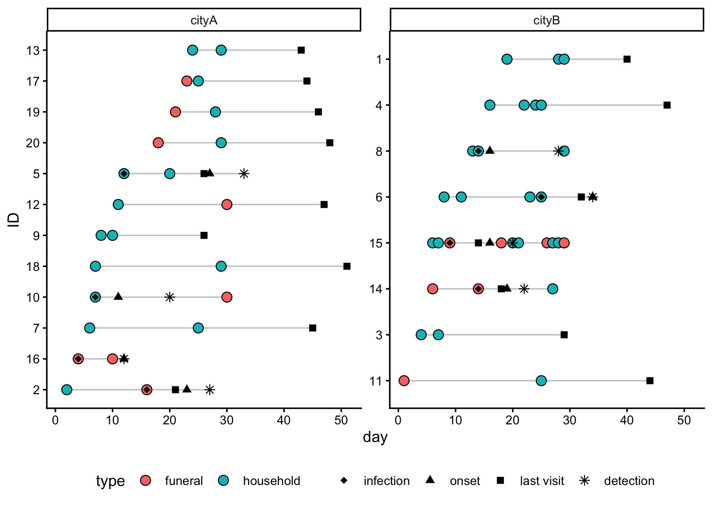

ctscore: Contact Tracing Scoring System
================

<!-- README.md is generated from README.Rmd. Please edit that file. -->
<!-- The code to render this README is stored in .github/workflows/render-readme.yaml -->
<!-- Variables marked with double curly braces will be transformed beforehand: -->
<!-- `packagename` is extracted from the DESCRIPTION file -->
<!-- `gh_repo` is extracted via a special environment variable in GitHub Actions -->

## Getting started

To install the package from github:

``` r
pak::pkg_install("thibautjombart/ctscore")
```

## Worked example

### Raw data

In the following, we read a toy dataset included in the package, which
contains simulated contact tracing data for 30 contacts. Each contact
has one or more exposures, some of which led to infection. Data are
stored inside xlsx files distributed with the package, but in practice
you would read your own data from csv or xlsx files.

``` r
library(ctscore)
library(rio)
library(tibble)
library(dplyr)
#> 
#> Attaching package: 'dplyr'
#> The following objects are masked from 'package:stats':
#> 
#>     filter, lag
#> The following objects are masked from 'package:base':
#> 
#>     intersect, setdiff, setequal, union
library(ggplot2)

## use the path to your own file in practice

linelist <- rio::import(system.file(
  "toy_linelist.xlsx",
  package = "ctscore"
)) |>
  tibble()

linelist
#> # A tibble: 30 × 5
#>    contact_id location   last_visit_date infected onset_date
#>         <dbl> <chr>                <dbl> <lgl>         <dbl>
#>  1          1 local_town              NA TRUE             22
#>  2          2 local_town              NA FALSE            NA
#>  3          3 local_town              NA TRUE              8
#>  4          4 hotspot                 NA TRUE             32
#>  5          5 hotspot                 14 FALSE            NA
#>  6          6 new_city                NA TRUE             10
#>  7          7 local_town              10 TRUE             11
#>  8          8 new_city                26 TRUE             29
#>  9          9 local_town              26 TRUE             35
#> 10         10 new_city                NA TRUE             11
#> # ℹ 20 more rows

exposures <- rio::import(
  system.file("toy_exposures.xlsx", package = "ctscore")
) |>
  tibble()

exposures
#> # A tibble: 46 × 3
#>    contact_id  date type     
#>         <dbl> <dbl> <chr>    
#>  1          1    19 funeral  
#>  2          2    13 household
#>  3          3     6 household
#>  4          4    25 funeral  
#>  5          5    12 household
#>  6          6     9 funeral  
#>  7          7     9 funeral  
#>  8          8    24 funeral  
#>  9          9     7 household
#> 10          9    17 household
#> # ℹ 36 more rows
```

### Creating a `ctdata` object

A `ctdata` object is a list containing two data frames:

- `linelist`: A data frame containing individual-level information, one
  row per `contact_id`. It contains the following columns:
  - `contact_id`: a unique identifier for each contact (required)
  - `location`: the location of the contact (optional)
  - `last_visit`: the date of the last visit to the contact (optional)
  - `infected`: a logical indicating whether the contact was infected
    (optional)
  - `onset_date`: the date of symptom onset (optional)
- `exposures`: A data frame containing exposure-level information, one
  row per exposure. It contains the following columns:
  - `contact_id`: a unique identifier for each contact (required)
  - `date`: the date of exposure, indicated as an integer since the
    first exposure; in practice, this could be actual dates in the
    format YYYY-MM-DD (required)
  - `type`: the type of exposure (e.g. “household”, “funeral”)
    (required)
  - `infection_proba`: the probability of infection for a type of
    exposure (derived from the `infection_proba` argument)

Infection probabilities (argument `infection_proba`) can be estimated
from previous contact tracing data, from the literature, or by expert
opinion. Here, we assume that household exposures have a 20% probability
of infection, while funeral exposures have a 90% probability of
infection.

``` r
x <- make_ctdata(
  linelist = linelist,
  exposures = exposures,
  infection_proba = list(household = 0.2, funeral = 0.9)
)
x
#> <ctdata>: 30 contact(s), 46 exposure(s)
#> 
#> $linelist
#> # A tibble: 30 × 5
#>    contact_id location   last_visit_date infected onset_date
#>    <chr>      <chr>                <dbl> <lgl>         <dbl>
#>  1 1          local_town              NA TRUE             22
#>  2 10         new_city                NA TRUE             11
#>  3 11         new_city                NA TRUE             12
#>  4 12         new_city                NA FALSE            NA
#>  5 13         hotspot                  5 TRUE             14
#>  6 14         hotspot                 NA TRUE             20
#>  7 15         hotspot                 27 FALSE            NA
#>  8 16         hotspot                 NA FALSE            NA
#>  9 17         hotspot                 NA TRUE             11
#> 10 18         local_town              28 FALSE            NA
#> # ℹ 20 more rows
#> 
#> $exposures
#> # A tibble: 46 × 4
#>    contact_id  date type      infection_proba
#>    <chr>      <dbl> <chr>               <dbl>
#>  1 1             19 funeral               0.9
#>  2 10             2 household             0.2
#>  3 10             5 household             0.2
#>  4 10            13 funeral               0.9
#>  5 11            11 household             0.2
#>  6 12            18 funeral               0.9
#>  7 13             1 funeral               0.9
#>  8 13             8 funeral               0.9
#>  9 13            28 household             0.2
#> 10 14            15 funeral               0.9
#> # ℹ 36 more rows
class(x)
#> [1] "ctdata"
```

Smaller datasets can be visualised using `plot()`:

``` r
plot(x)
```



### Scoring with `ctscore()`

`ctscore` computes, for each contact, the probability that a visit today
will lead to detecting a new case.

First, we need to specify incubation period distribution, which can be
provided either as a vector of probabilities (giving p(0 day), p(1 day),
p(2 days) …) or as a `distcrete` object as returned by
distcrete::distcrete(). Here, we generate a dummy incubation time
distribution as a discretized Gamma:

``` r
incub <- distcrete::distcrete(
  "gamma",
  interval = 1,
  shape = 3.5,
  scale = 2.5,
  w = 0
)

plot(
  incub$d(0:30),
  type = "h",
  lwd = 6,
  lend = 1,
  xlab = "Days since infection",
  ylab = "Probability of symptom onset",
  main = "Incubation time distribution",
  col = 2
)
```


We can now calculate the `score` using the `ctscore()` function, the
current date is day 31 (again, this could be a real date in practice, in
YYYY-MM-DD format):

``` r
score <- ctscore(x, incub, current_date = 31)
score
#>          1         10         11         12         13         14         15 
#> 0.75160666 0.91833598 0.19675645 0.78488929 0.98886504 0.85942526 0.46260342 
#>         16         17         18         19          2         20         21 
#> 0.01314619 0.89862699 0.17565593 0.20034744 0.19379145 0.19806789 0.91994096 
#>         22         23         24         25         26         27         28 
#> 0.19762332 0.08951862 0.17677369 0.22575593 0.19547637 0.16702370 0.81157143 
#>         29          3         30          4          5          6          7 
#> 0.84863053 0.19969489 0.78407698 0.37251628 0.19462428 0.89302170 0.89053700 
#>          8          9 
#> 0.42430699 0.28448157
```

For prioritising individuals, `add_ctscore()` attaches the scores onto
the `linelist` of the `ctdata` object:

``` r
## ctdata with a `score` column in the linelist
xs <- add_ctscore(x, score)
```

We can use a simple plot to visualise the scores for each contact, which
can be useful for prioritising visits:

``` r
xs$linelist |>
  ggplot(aes(x = score, y = reorder(contact_id, score))) +
  geom_col() +
  theme_bw() +
  labs(
    x = "ctscore (probability of detecting symptoms)",
    y = "Contact ID",
    title = "Contact tracing scoring"
  )
```



We can use `as_tibble()` to flatten the `ctdata` object into a single
data frame. The argument `by_contact` indicates whether to return one
row per contact (TRUE) or one row per exposure (FALSE, default):

``` r
as_tibble(xs, by_contact = TRUE) |>
  slice_max(score, n = 1)
#> # A tibble: 1 × 7
#>   contact_id location last_visit_date infected onset_date score exposures       
#>   <chr>      <chr>              <dbl> <lgl>         <dbl> <dbl> <list>          
#> 1 13         hotspot                5 TRUE             14 0.989 <tibble [3 × 3]>

as_tibble(xs) |>
  filter(contact_id == 13)
#> # A tibble: 3 × 9
#>   contact_id  date type      infection_proba location last_visit_date infected
#>   <chr>      <dbl> <chr>               <dbl> <chr>              <dbl> <lgl>   
#> 1 13             1 funeral               0.9 hotspot                5 TRUE    
#> 2 13             8 funeral               0.9 hotspot                5 TRUE    
#> 3 13            28 household             0.2 hotspot                5 TRUE    
#> # ℹ 2 more variables: onset_date <dbl>, score <dbl>
```

The contact (ID 13) has the highest score because they had multiple
exposures, including several funeral exposures, and were last seen 26
days ago (on day 5, current day is 31), so there was ample time for
symptoms to have appeared since then. In fact, the linelist recorded
that this contact was infected and developed symptoms on day 14.

``` r
as_tibble(xs, by_contact = TRUE) |>
  slice_min(score, n = 1) |>
  _[["exposures"]]
#> [[1]]
#> # A tibble: 1 × 3
#>    date type      infection_proba
#>   <dbl> <chr>               <dbl>
#> 1    29 household             0.2
```

The lowest scoring contact had a single ‘weak’ exposure only 2 days ago,
so that it is unlikely that the individual has been infected, and if
they have been, it is unlikely that they have developed symptoms yet.

## Simulations

## Simulating contact tracing data

We can simulate contact tracing data using the `sim_ctdata()` function.
This function generates a synthetic dataset of contacts and exposures,
which can be useful for testing different follow-up strategies and
evaluating the performance of the scoring system. See `?sim_ctdata` for
details on the arguments.

``` r
set.seed(123)
sim <- sim_ctdata(
  n_contacts = 20,
  duration = 30,
  incub = incub$r(100),
  locations = list(cityA = 0.7, cityB = 0.3),
  n_exposures = list(cityA = 2, cityB = c(2, 2, 3, 4, 5, 10)),
  infection_proba = list(household = 0.2, funeral = 0.4),
  type_proba = list(household = 0.7, funeral = 0.3)
)
sim
#> <ctdata>: 20 contact(s), 55 exposure(s)
#> 
#> $linelist
#> # A tibble: 20 × 6
#>    contact_id location last_visit_date infected onset_date infection_date
#>    <chr>      <chr>              <dbl> <lgl>         <dbl>          <dbl>
#>  1 1          cityB                 NA FALSE            NA             NA
#>  2 10         cityA                 NA TRUE             11              7
#>  3 11         cityB                 NA FALSE            NA             NA
#>  4 12         cityA                 NA FALSE            NA             NA
#>  5 13         cityA                 NA FALSE            NA             NA
#>  6 14         cityB                 NA TRUE             19             14
#>  7 15         cityB                 NA TRUE             16              9
#>  8 16         cityA                 NA TRUE             12              4
#>  9 17         cityA                 NA FALSE            NA             NA
#> 10 18         cityA                 NA FALSE            NA             NA
#> 11 19         cityA                 NA FALSE            NA             NA
#> 12 2          cityA                 NA TRUE             23             16
#> 13 20         cityA                 NA FALSE            NA             NA
#> 14 3          cityB                 NA FALSE            NA             NA
#> 15 4          cityB                 NA FALSE            NA             NA
#> 16 5          cityA                 NA TRUE             27             12
#> 17 6          cityB                 NA TRUE             34             25
#> 18 7          cityA                 NA FALSE            NA             NA
#> 19 8          cityB                 NA TRUE             16             14
#> 20 9          cityA                 NA FALSE            NA             NA
#> 
#> $exposures
#> # A tibble: 55 × 4
#>    contact_id  date type      infection_proba
#>    <chr>      <int> <chr>               <dbl>
#>  1 1             19 household             0.2
#>  2 1             28 household             0.2
#>  3 1             29 household             0.2
#>  4 10             7 household             0.2
#>  5 10            30 funeral               0.4
#>  6 11             1 funeral               0.4
#>  7 11            25 household             0.2
#>  8 12            11 household             0.2
#>  9 12            30 funeral               0.4
#> 10 13            24 household             0.2
#> # ℹ 45 more rows
```

`last_visit_date` is empty as we have not yet simulated a follow-up
strategy. We can simulate a follow-up strategy using the
`sim_followup()` function.

``` r
f <- sim |>
  sim_followup(
    time = 30,
    delay = 5,
    duration = incub$q(0.99),
    coverage = 0.2,
    strategy = "random"
  )
f |> as_tibble(by_contact = TRUE)
#> # A tibble: 20 × 8
#>    contact_id location last_visit_date infected onset_date infection_date
#>    <chr>      <chr>              <dbl> <lgl>         <dbl>          <dbl>
#>  1 1          cityB                 40 FALSE            NA             NA
#>  2 10         cityA                 NA TRUE             11              7
#>  3 11         cityB                 44 FALSE            NA             NA
#>  4 12         cityA                 47 FALSE            NA             NA
#>  5 13         cityA                 43 FALSE            NA             NA
#>  6 14         cityB                 18 TRUE             19             14
#>  7 15         cityB                 14 TRUE             16              9
#>  8 16         cityA                 NA TRUE             12              4
#>  9 17         cityA                 44 FALSE            NA             NA
#> 10 18         cityA                 51 FALSE            NA             NA
#> 11 19         cityA                 46 FALSE            NA             NA
#> 12 2          cityA                 21 TRUE             23             16
#> 13 20         cityA                 48 FALSE            NA             NA
#> 14 3          cityB                 29 FALSE            NA             NA
#> 15 4          cityB                 47 FALSE            NA             NA
#> 16 5          cityA                 26 TRUE             27             12
#> 17 6          cityB                 32 TRUE             34             25
#> 18 7          cityA                 45 FALSE            NA             NA
#> 19 8          cityB                 NA TRUE             16             14
#> 20 9          cityA                 26 FALSE            NA             NA
#> # ℹ 2 more variables: detection_date <dbl>, exposures <list>
```

``` r
plot(f) +
  facet_wrap(~location, scales = "free_y")
```


