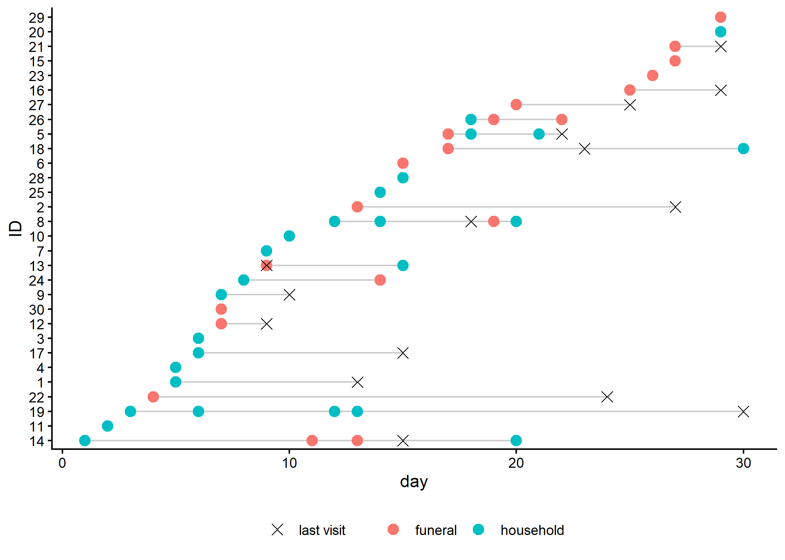
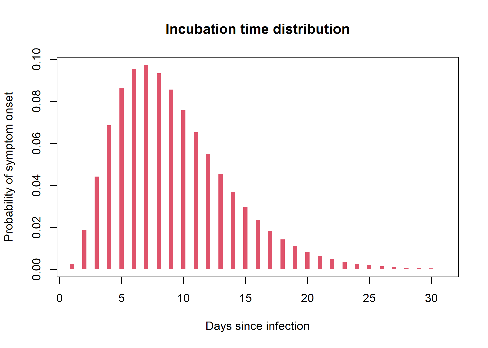
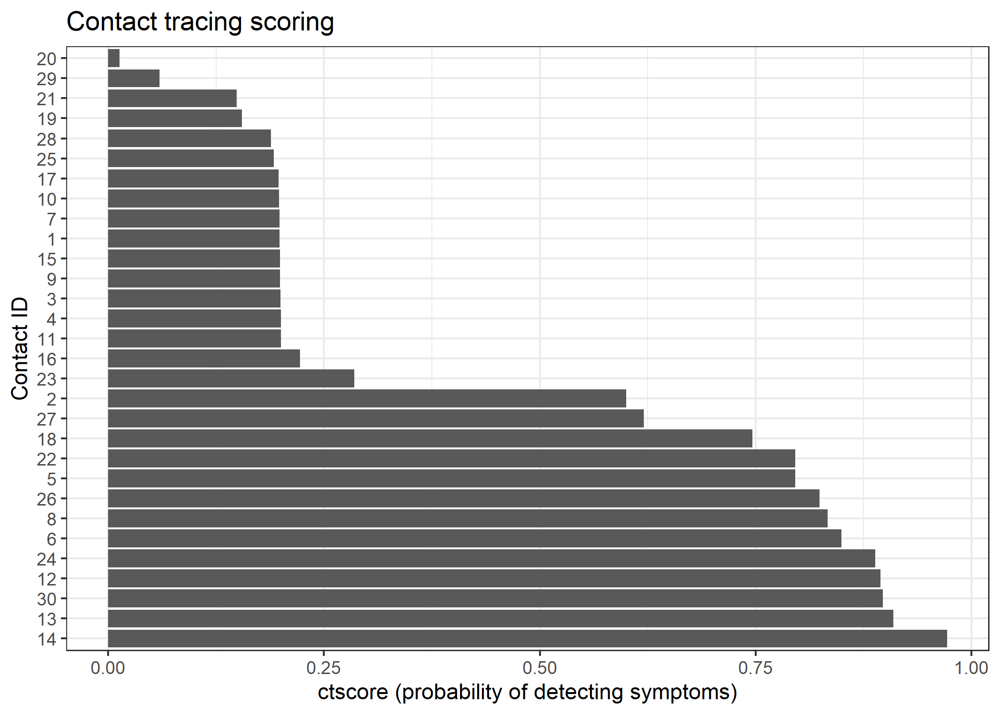

# ctscore: Contact Tracing Scoring System

## Getting started

To install the package from github:

``` r

pak::pkg_install("thibautjombart/ctscore")
```

## Worked example

In the following, we read a toy dataset included in the package, which
contains simulated contact tracing data for 30 contacts. Each contact
has one or more exposures, some of which led to infection. Data are
stored inside an xlsx file distributed with the package, but in practice
you would read your own data from a csv or xlsx file.

``` r

library(ctscore)
library(rio)
library(magrittr)
library(tibble)
library(dplyr)
#> 
#> Attaching package: 'dplyr'
#> The following objects are masked from 'package:stats':
#> 
#>     filter, lag
#> The following objects are masked from 'package:base':
#> 
#>     intersect, setdiff, setequal, union
library(ggplot2)

## use the path to your own file in practice 
path_to_file <- system.file("toy_ctdata.xlsx", package = "ctscore")

## read the data in
raw_data <- rio::import(path_to_file) %>% 
  tibble()

raw_data
#> # A tibble: 46 × 7
#>    contact_id  date type      location   last_visit infected onset
#>         <dbl> <dbl> <chr>     <chr>           <dbl> <lgl>    <dbl>
#>  1          1     5 household new_city           13 FALSE       NA
#>  2          2    13 funeral   new_city           27 FALSE       NA
#>  3          3     6 household local_town         NA FALSE       NA
#>  4          4     5 household new_city           NA FALSE       NA
#>  5          5    17 funeral   hotspot            22 TRUE        23
#>  6          5    18 household hotspot            22 TRUE        23
#>  7          5    21 household hotspot            22 TRUE        23
#>  8          6    15 funeral   local_town         NA FALSE       NA
#>  9          7     9 household local_town         NA FALSE       NA
#> 10          8    14 household hotspot            18 TRUE        24
#> # ℹ 36 more rows
```

Each row corresponds to a reported exposure. The file contains the
following information:

- `contact_id`: a unique identifier for each contact
- `date`: the date of exposure, indicated as an integer since the first
  exposure; in practice, this could be actual dates in the format
  YYYY-MM-DD
- `type`: the type of exposure; here, either “household” or “funeral”
- `location`: the location of the contact; here, either “new_city”,
  “local_town”, or “hotspot”; these would be actual names of places in
  practice
- `last_visit`: the date of the last visit to the contact, where they
  exhibited no symptoms; if the contact has not been visited yet, this
  is `NA`
- `infected`: the simulation truth, indicating whether the contact was
  infected or not; this is not known in practice, but is included here
  for demonstration purposes
- `onset`: the simulation truth, indicating the day of symptom onset for
  infected contacts; this may is not known in practice, but is included
  here for demonstration purposes

Now that we have imported the data into R, we need to convert them to a
`ctdata` object using
[`make_ctdata()`](thibautjombart.github.io/ctscore/reference/make_ctdata.md)
(see ?make_ctdata for details).

Infection probabilities (argument `infection_proba`) can be estimated
from previous contact tracing data, from the literature, or by expert
opinion. Here, we assume that household exposures have a 20% probability
of infection, while funeral exposures have a 90% probability of
infection.

``` r

x <- make_ctdata(
  contact_id = raw_data$contact_id,
  date = raw_data$date,
  type = raw_data$type,
  location = raw_data$location,
  infection_proba = list(household = 0.2, funeral = 0.9),
  last_visit = raw_data$last_visit
)

head(x)
#>   contact_id date      type   location last_visit p_infection
#> 1          1    5 household   new_city         13         0.2
#> 2         10   10 household local_town         NA         0.2
#> 3         11    2 household   new_city         NA         0.2
#> 4         12    7   funeral    hotspot          9         0.9
#> 5         13    9   funeral local_town          9         0.9
#> 6         13   15 household local_town          9         0.2
class(x)
#> [1] "ctdata"     "data.frame"
```

Smaller datasets can be visualised using
[`plot()`](https://rdrr.io/r/graphics/plot.default.html):

``` r

plot(x)
```



Next, we need to specify incubation time distribution, which can be
provided either as a vector of probabilities (giving p(0 day), p(1 day),
p(2 days) …) or as a `distcrete` object as returned by
distcrete::distcrete(). Here, we generate a dummy incubation time
distribution as a discretized Gamma:

``` r

incub <- distcrete::distcrete(
  "gamma", 
  interval = 1, 
  shape = 3.5, 
  scale = 2.5, w = 0
)
plot(
  incub$d(0:30), type = "h", lwd = 6, lend = 1, 
  xlab = "Days since infection", 
  ylab = "Probability of symptom onset",
  main = "Incubation time distribution",
  col = 2
)
```



We can now calculate the `ctscore` using the
[`ctscore()`](thibautjombart.github.io/ctscore/reference/ctscore.md)
function, the current date is day 31 (again, this could be a real date
in practice, in YYYY-MM-DD format):

``` r

score <- ctscore(x, incub, current_date = 31)
score
#>          1         10         11         12         13         14         15 
#> 0.19854218 0.19772316 0.20028407 0.89463558 0.90958819 0.97174690 0.19870824 
#>         16         17         18         19          2         20         21 
#> 0.22232470 0.19754793 0.74628901 0.15502167 0.60000140 0.01314619 0.14895995 
#>         22         23         24         25         26         27         28 
#> 0.79589928 0.28480854 0.88870951 0.19158821 0.82388155 0.62067571 0.18872827 
#>         29          3         30          4          5          6          7 
#> 0.05915784 0.19969489 0.89728078 0.19991568 0.79604599 0.84927722 0.19844927 
#>          8          9 
#> 0.83344774 0.19871356
```

`score` indicates, for each contact, the probability that a visit today
will lead to detecting a new case.

For convenience, we can ask `ctscore` to return results in other formats
through the argument `out_type`:

- “ctdata”: returns a `ctdata` object with only individual data and
  scores (stripping exposures); this is the most useful for prioritising
  individuals for visits

- “data.frame”: returns a `data.frame` with contact IDs and scores

- “ctdata_full”: a `ctdata` object with an additional column for the
  scores appended to the exposure database

``` r

## `ctdata` with individual info and  scores, sorted by score
res <- ctscore(x, incub, current_date = 31, out_type = "ctdata") %>% 
    arrange(desc(score))
head(res)
#>   contact_id   location last_visit     score
#> 1         14    hotspot         15 0.9717469
#> 2         13 local_town          9 0.9095882
#> 3         30 local_town         NA 0.8972808
#> 4         12    hotspot          9 0.8946356
#> 5         24    hotspot         NA 0.8887095
#> 6          6 local_town         NA 0.8492772

## ctdata object with scores appended, sorted by score
res_full <- ctscore(x, incub, current_date = 31, out_type = "ctdata_full") %>% 
  arrange(desc(score))
```

We can use a simple plot to visualise the scores for each contact, which
can be useful for prioritising visits:

``` r


## some wrangling needed to keep the order of contacts in the plot
res %>% 
  mutate(contact_id = factor(contact_id, levels = unique(contact_id))) %>% 
ggplot(aes(x = score, y = contact_id)) + 
  geom_col() + 
  theme_bw() + 
  labs(x = "ctscore (probability of detecting symptoms)", 
       y = "Contact ID", 
       title = "Contact tracing scoring")
```



We can look at the first and last scores to understand how the scoring
system works.

``` r

head(res_full)
#>   contact_id date      type   location last_visit p_infection     score
#> 1         14    1 household    hotspot         15         0.2 0.9717469
#> 2         14   11   funeral    hotspot         15         0.9 0.9717469
#> 3         14   13   funeral    hotspot         15         0.9 0.9717469
#> 4         14   20 household    hotspot         15         0.2 0.9717469
#> 5         13    9   funeral local_town          9         0.9 0.9095882
#> 6         13   15 household local_town          9         0.2 0.9095882
```

The first contact (ID 14) has the highest score because they had
multiple exposures, including several funeral exposures, and were last
seen 16 days ago (on day 15, current day is 31), so there was ample time
for symptoms to have appeared since then. The second contact (ID 13) has
a high score for the same reasons: multiple exposures, and a last visit
a long time ago.

``` r

tail(res_full)
#>    contact_id date      type   location last_visit p_infection      score
#> 41         19    6 household    hotspot         30         0.2 0.15502167
#> 42         19   12 household    hotspot         30         0.2 0.15502167
#> 43         19   13 household    hotspot         30         0.2 0.15502167
#> 44         21   27   funeral    hotspot         29         0.9 0.14895995
#> 45         29   29   funeral local_town         NA         0.9 0.05915784
#> 46         20   29 household    hotspot         NA         0.2 0.01314619
```

The very last contact (ID 20) has a low score because of a single ‘weak’
exposure only 2 days ago, so that it is unlikely that the individual has
been infected, and if they have been, it is unlikely that they have
developed symptoms yet.

The second last contact (ID 29) reported a high-risk (funeral) exposure,
but this was very recent (day 29) so they are unlikely to show symptoms
just yet.

The situation is the same for the third last contact (ID 21), whose
funeral exposure is yet too recent to show symptoms just yet, if they
were infected.

The fourth last contact (ID 19) has reported multiple weak exposures,
but they were last visited yesterday and showed no symptoms, so they are
unlikely to be infected.
